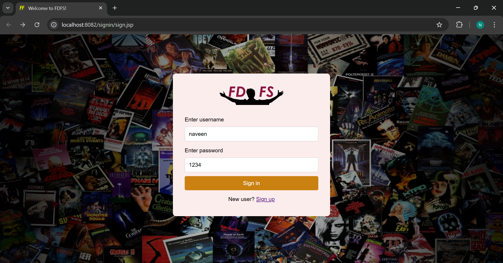
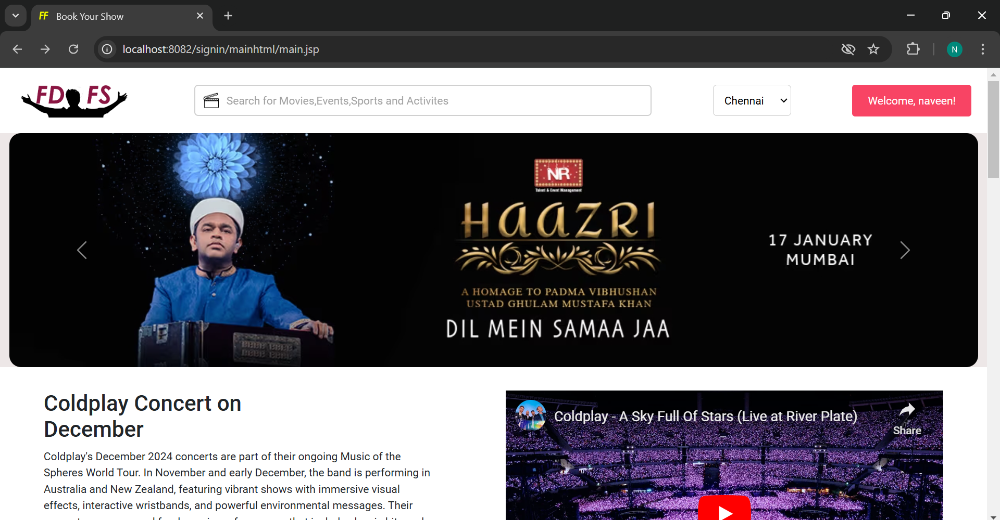
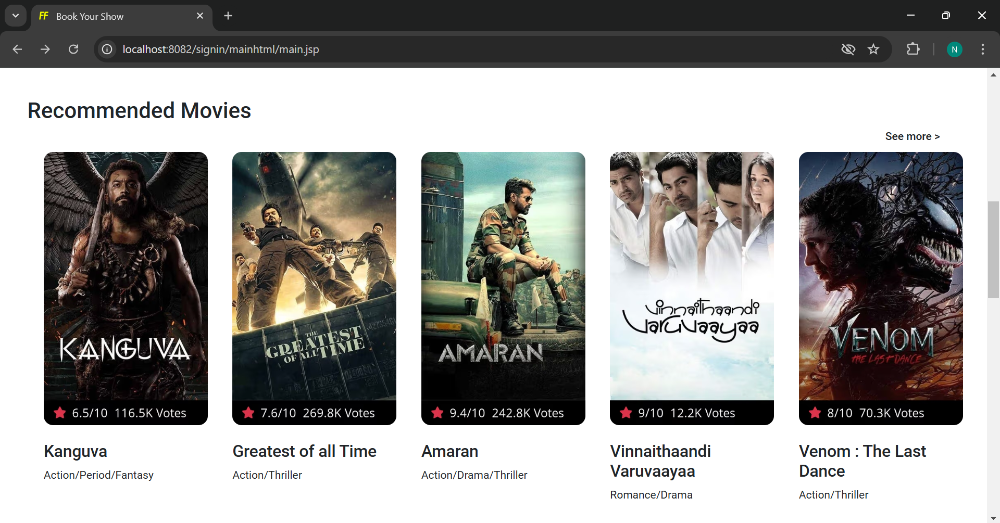
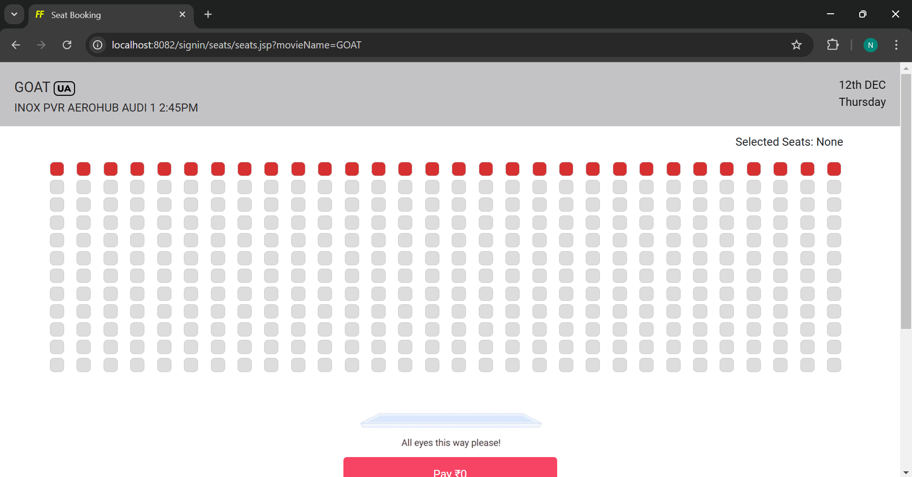
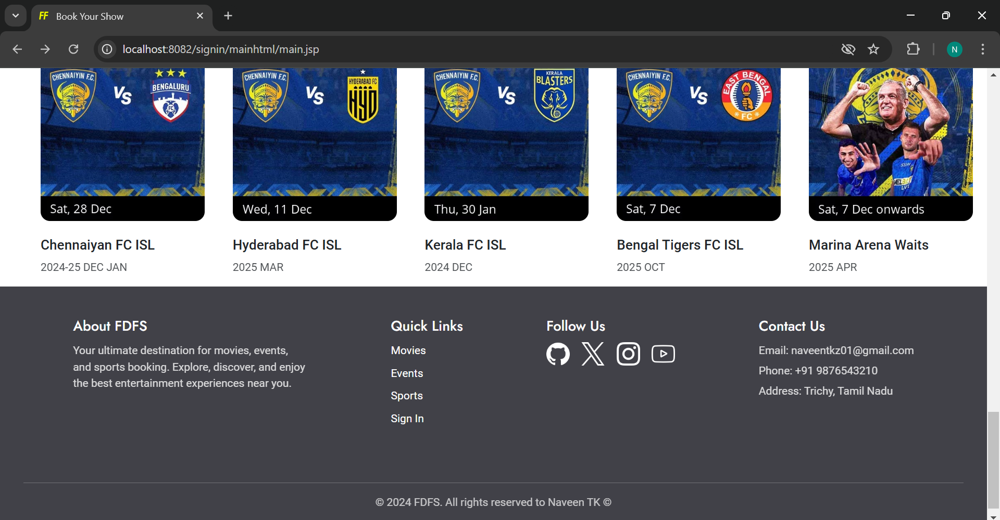

# FDFS - Movie Booking Web App

## Overview
FDFS (First Day First Show) is a dynamic web application designed to simplify the movie booking experience. The project leverages JSP, Servlets, and PostgreSQL for backend operations, along with HTML, CSS,Bootstrap and JavaScript for an engaging and interactive user interface.

---

## Features
1. **User Authentication:**
   - **Sign-In Page:** Validates user credentials against the database.
   - **Sign-Up Page:** Allows new users to register by saving their details to the database.

2. **Movie Listing:**
   - Displays a list of available movies on the main page.
   - Users can select a movie to proceed to the seat booking page.

3. **Seat Booking:**
   - An interactive seat booking interface designed using JSP, CSS, and JavaScript.

---

## Tech Stack
- **Frontend:** HTML, CSS, JavaScript,Bootstrap
- **Backend:** JSP, Servlets
- **Database:** PostgreSQL
- **Development Environment:** Eclipse IDE with Apache Tomcat server

---

## Setup Instructions
### Prerequisites
- Eclipse IDE
- JDK 8 or later
- Apache Tomcat 9 or later
- PostgreSQL installed (port: 5432)

### Steps
1. Clone the repository:
   ```bash
   git clone https://github.com/your-username/FDFS.git
   ```
2. Import the project into Eclipse IDE:
   - Open Eclipse.
   - Select `File > Import > Existing Projects into Workspace`.
   - Browse to the cloned repository and click `Finish`.

3. Configure PostgreSQL:
   - Create a database named `login`.
   - Execute the SQL script provided in `database/setup.sql` to set up tables and initial data.
   - To use PostgreSQL you can use PGAdmin

5. Update `db-config.properties` file with your PostgreSQL credentials:
   ```properties
   db.url=jdbc:postgresql://localhost:5432/login
   db.username=your_username
   db.password=your_password
   ```
6. Configure Apache Tomcat in Eclipse:
   - Go to `Window > Preferences > Server > Runtime Environments`.
   - Add Apache Tomcat and specify its installation directory.
   - Right-click on the project in the `Project Explorer` and select `Run As > Run on Server`.

7. Access the application at `http://localhost:8081/FDFS`.

---

## Screenshots
### Sign-In Page:


### Main Page:



### Seat Booking Page:


### Footer for all pages


---

## Contributing
1. Fork the repository.
2. Create a new branch for your feature/bug fix:
   ```bash
   git checkout -b feature-name
   ```
3. Commit your changes:
   ```bash
   git commit -m "Description of your changes"
   ```
4. Push to your fork and create a pull request.

---

## License
This project is licensed under the MIT License - see the [LICENSE](LICENSE) file for details.

---

## Contact
For any questions or suggestions, feel free to reach out:
- Email: naveentk1010@gmail.com
- GitHub: [naveentk10](https://github.com/naveentk10)

